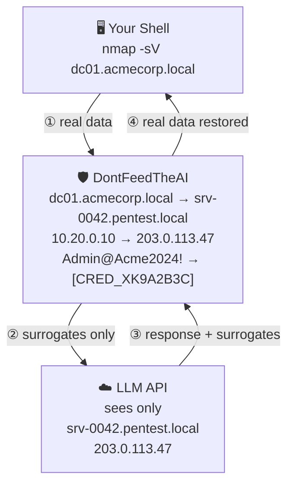
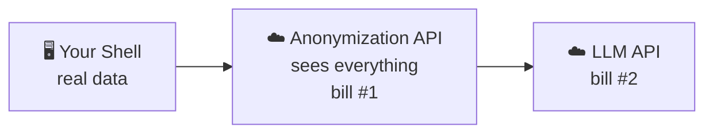
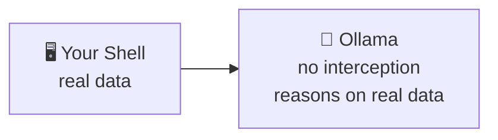
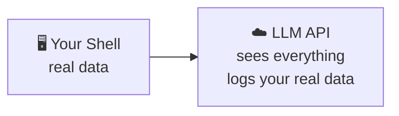
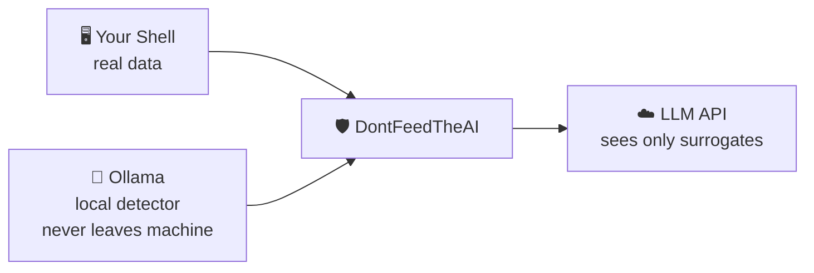

# DontFeedTheAI

<p align="center">
  
</p>

<p align="center">
  
  
  
  
  
</p>

A transparent proxy that strips IPs, credentials, hostnames, and PII from every request before it reaches the AI — and restores them on the way back.

> **Local-hardened fork.** This fork runs purely locally: the vault is **encrypted
> at rest** (`VAULT_KEY`, fail-closed), the HTTP **audit/reverse-lookup endpoint is
> removed**, the proxy binds to **loopback only**, and outbound traffic is
> restricted to an **allowlist** of the configured LLM upstreams. Only masked
> surrogates ever leave the machine.



| Layer | Detects |
|---|---|
| 🧠 **Ollama (local LLM)** | hostnames, org names, credentials in prose |
| 🔍 **Regex** | IPs, hashes, tokens, API keys |

Both run on your machine. Nothing sensitive crosses the boundary.

---

| Who | How it helps |
|-----|-------------|
| **Pentesters** | Run nmap, mimikatz, bloodhound output through Claude without exposing client infrastructure |
| **Developers & SREs** | Debug with production data or internal configs in regulated environments |
| **Legal & consulting** | Anonymize client contracts, case files, or proprietary IP in AI-assisted reviews |
| **Finance & compliance** | Analyze reports or audit scripts without exposing account details |
| **Researchers** | Query LLMs on confidential datasets |

---

## Why not just send data directly?

**❌ Cloud anonymization API + LLM** — two bills, two third parties. Your sensitive data still leaves the machine, just through more hands.



**❌ Ollama alone** — your data never leaves the machine, but Ollama has no awareness of what's sensitive.
It reasons on whatever you paste: real IPs, real credentials, real hostnames.



**❌ Claude / OpenAI directly** — best reasoning quality, but everything lands in their infrastructure.
Real client IPs, credentials, org names in API logs — one policy change or breach away from a problem.



**✅ DontFeedTheAI** — cloud reasoning quality, local detection, nothing sensitive crosses the boundary.
Works with Claude Code, OpenAI SDK, OpenRouter, or any OpenAI-compatible client.



→ See [docs/architecture.md](docs/architecture.md) for the full technical breakdown.
For supported LLM clients and upstream configuration, see [docs/providers.md](docs/providers.md).

---

## Quick Start

**With a VPS** (recommended for team use or persistent engagements):

```bash
git clone https://github.com/zeroc00I/DontFeedTheAI
cd DontFeedTheAI
python3 wizard.py
```

The wizard asks everything — engagement name, VPS address, model — then deploys, opens the SSH tunnel, and launches Claude with the proxy active.

**Locally without a VPS:**

```bash
python3 wizard.py setup       # create venv + install dependencies
export VAULT_KEY="$(openssl rand -hex 32)"   # required — encrypts the vault (keep it safe)
python3 wizard.py docker up   # start proxy + Ollama in Docker (loopback only)
export ANTHROPIC_BASE_URL=http://localhost:8080
export ENGAGEMENT_ID=my-engagement
claude                        # or any OpenAI-compatible client
```

`VAULT_KEY` is **required**: the surrogate→original vault is encrypted at rest and
the proxy will not start without it. Export it in your shell (do not put it in
`.env`) so the passphrase never lands on disk. If you lose it, the vault cannot
be decrypted.

Works on Windows, macOS, and Linux.

```bash
python3 wizard.py --help   # all available commands
```

---

## Docs

| Doc | About |
|--|--|
| [Architecture](docs/architecture.md) | Two-layer pipeline, what gets anonymized and what doesn't, config reference |
| [Providers](docs/providers.md) | Supported LLM clients: Claude Code, OpenAI SDK, OpenRouter |
| [Contributing](docs/contributing.md) | How to add fixtures, run the improvement loop, open areas |
| [Threat Model](docs/threat-model.md) | What this protects against, what it doesn't, limitations, roadmap |

---

## Verifying coverage & contributing improvements

Two tools ship with DontFeedTheAI to help you validate coverage and extend it.

> **Note (local-hardening fork):** the in-browser audit dashboard has been
> **removed** — it exposed the full `surrogate → original` lookup table over HTTP.
> The vault is encrypted at rest and the mapping is never served over the network.
> Use the loops below to validate coverage instead.

**Testing the full pipeline** — requires Ollama running:

```bash
python3 wizard.py test --integration
```

Runs all 53 fixtures through the complete pipeline (LLM + regex) and asserts zero leaks. Without `--integration`, the LLM is mocked and only the regex layer is validated — useful for fast iteration but not a substitute for the full run.

**Auto-improvement loop** — regex layer only, no Ollama required:

```bash
python3 wizard.py improve --cycles 3
```

Runs all fixtures through the regex layer, reports leaks and false positives, and tells you exactly which strings slipped through. The contribution cycle is: add a fixture for a real tool you use → run the loop → add a regex pattern for each leak → repeat. See [Contributing](docs/contributing.md).

The two commands complement each other: `improve` tightens the regex floor fast; `test --integration` confirms the full pipeline holds.

---

## A note from the author

> I'm a pentester, not a software architect.
>
> This wasn't built to be innovative — there are already cloud APIs that do LLM-based anonymization. But that means sending your data to yet another third party, and I refuse. If you work in security, you already know why.
>
> I built this so the architecture would be available to everyone, and so the community could help expand its effectiveness for free. You're paying for context processing — the AI doesn't need your real data for that.
>
> — *zeroc00I*

---

## Star History

[](https://star-history.com/#zeroc00I/DontFeedTheAI&Date)

---

## License

[MIT](LICENSE)
